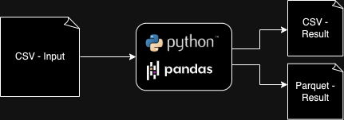

# Earnest Analytics Code Test

## Instructions
1. Install Python3 (this demo is using Python 3.7.3 and MacOS)
2. Install `pip` package manager https://pip.pypa.io/en/stable/installation/
3. Install Python3 virtual environment `pip3 install virtualenv` 
4. Create virtual environment `python3 -m venv {env name}` e.g. `python3 -m venv earnest_env`
5. Activate environment `source {env name}/bin/activate` e.g. `source earnest_env/bin/activate`
6. Go to root project folder `cd /Users/.../ea-code-test`
7. Run `pip install -r requirements.txt` (if there is any incompatibility error, try to replace `requirements.txt` with `requirements-any.txt`)
8. Run `python main.py`. If everything is fine, you should see:
```
Script Start
Script End - Successfuly
```
10. Run test `pytest`. If all tests passed, you should see:
```
collected 17 items

test_data_step_2.py ............                                                                                                                                                                 [ 70%]
test_data_step_4.py .....                                                                                                                                                                        [100%]

====== 17 passed in 0.43s ======
```
11. Optionaly you can open `main.ipynb` and run the scripts using `Jupyter Noteboook` (https://jupyter.org/install) -> you need to attach first the virtual environment created at step 4 to the `Jupyter Noteboook`.

## Implementation and design
I chose to implement the solution using:
- Python3
- Pandas library (https://pandas.pydata.org/)
- Jupyter Notebook (https://jupyter.org/)



## Further work to do to make it production ready
- Add more exception handlings, logging and monitoring service e.g. `Sentry`
- Add the script to orchestration / data pipeline tool such as `Apache Airflow` to enable scheduling
- Put the input CSV in S3 or remote location
- Upload the result files to S3 or database tables